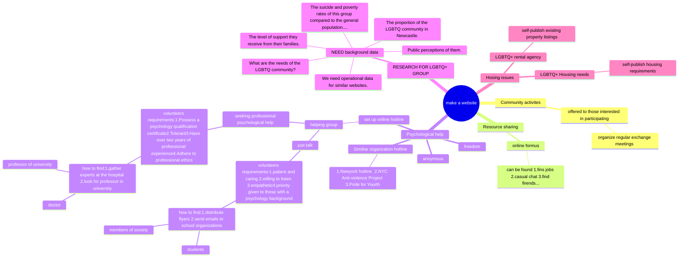

```mermaid 
mindmap
  root((make a website))
    Community activites 
      offered to those interested in participating
       organize regular exchange meetings 
    Resource sharing
     online formus
      can be found 1.fins jobs 2.casual chat 3.find firends...
    Psychological help
     freedom
     anoymous
     Similiar organzation hotline
      1.Newyork hotline  2.NYC Anti-violence Project 3.Pride for Yourth
     set up online hotline 
      helping group
       just talk 
        volunteers requirements:1.patient and caring 2.willing to listen 3.empathetic4.priority given to those with a psychology background
         how to find:1.distribute flyers 2.send emails to school organizations
          students
          members of society   
       seeking professional psychological help 
        volunteers requirements:1.Possess a psychology qualification certificate2.Tolerant3.Have over two years of professional experience4.Adhere to professional ethics
         how to find:1.gather experts at the hospital 2.look for professor in university
          doctor
          professor of university
    RESEARCH FOR LGBTQ+ GROUP
     NEED background data 
            The proportion of the LGBTQ community in Newcastle.
            What are the needs of the LGBTQ community?
            The level of support they receive from their families.
            We need operational data for similar websites.
            Public perceptions of them.
            The suicide and poverty rates of this group compared to the general population....

    Hosing issues
      LGBTQ+ rental agency
       self-publish existing property listings
      LGBTQ+ Housing needs 
       self-publish housing requirements
```       